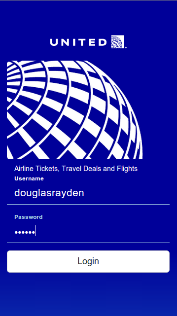
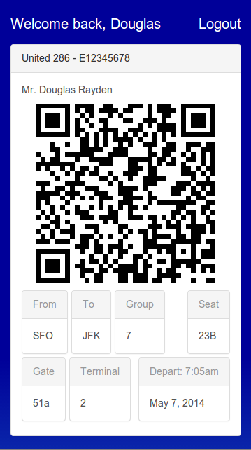

United.com mobile app

a. Allow the user to log in and for the app to display their name

b. Allow the user to find their boarding pass on their phone in the security line and have it available by the time they are in front of the TSA agent.

Install/Run
- make sure you have node.js installed
- run `npm install`
- run `bower install`
- run `gulp build`
- open app/index.html or `gulp connect` then localhost:9000
